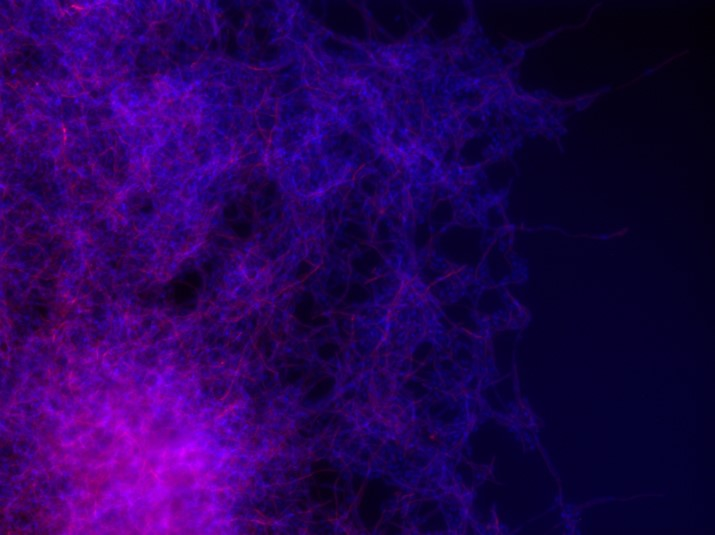

  <picture style="display: block; margin: auto;">
    <source media="(prefers-color-scheme: dark)" width="40%"  srcset="Images/Bild1.jpg">
    <source media="(prefers-color-scheme: light)" width="40%" srcset="Images/BF.jpg">
    
  </picture>

### Hi there 👋

- 🤓 I’m currently working on my PhD in the field of image analysis with AI
- 🔬 Ask me about microscopy imaging, imgage analysis, cell segmentations ...
- :octocat: Working with Machine Learning, Deep Learning and AI 
 

### Languages

  &nbsp;
  &nbsp;
  

 

### Editors

  &nbsp;
  &nbsp;
  &nbsp;
  &nbsp;
  &nbsp;

 

### Platforms/OS

  &nbsp;
  &nbsp;
  &nbsp;

 

### Tools

  &nbsp;
  &nbsp;
  &nbsp;

 

### Packages

  &nbsp;
  &nbsp;
  &nbsp;
  &nbsp;
  &nbsp;
  &nbsp;
  &nbsp;
  Cellpose&nbsp;
  Pillow&nbsp;

- Shapely

