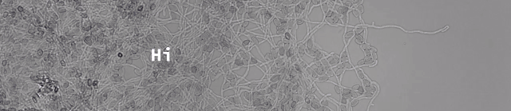

<!---
<p align="center">
  <picture style="display: block; margin: auto;">
    <source media="(prefers-color-scheme: dark)" width="40%"  srcset="Images/Bild1.jpg">
    <source media="(prefers-color-scheme: light)" width="40%" srcset="Images/BF.jpg">
    
  </picture>
</p>
[](https://git.io/typing-svg)
--->

<p align="center" >
  
</p>


[](https://medium.com/@alexloewe87)&nbsp;
[](https://www.linkedin.com/in/alexandra-löwe-6b3006136/)&nbsp;
[](https://github.com/AlexandraLoewe)&nbsp;
<br><br>

🤓 I’m currently working on my PhD in the field of image analysis with AI<br>
🔬 Ask me about microscopy imaging, imgage analysis, cell segmentations ...<br>
:octocat: Working with Machine Learning, Deep Learning and AI 
<br>
<br>


```python
class Alex:
  pronouns= ["she" | "her"]
  code = [Python, R, LaTex]
  editors = [VSCode, Spyder, Jupyter, RStudio, MatLab]
  platforms = [Windows, Linux, LinuxServer, RaspberryPi]
  tools = [Docker, Slack, Git]
  packages = [Scikitlearn,
              json,
              Keras,
              Matplotlib,
              openCV,
              PyTorch,
              TensorFlow,
              CellPose,
              Pillow,
              Shapely,
  ]
```
<!---
### Languages

<p>
  &nbsp;
  &nbsp;
  <picture>
    <source media="(prefers-color-scheme: dark)" width="4%"  srcset="Images/latex-svgrepo-com.svg">
    <source media="(prefers-color-scheme: light)" width="4%" srcset="https://github.com/devicons/devicon/blob/master/icons/latex/latex-original.svg">
    
  </picture>
</p>
<br>

### Editors

<p>
  &nbsp;
  <picture>
    <source media="(prefers-color-scheme: dark)" width="4%"  srcset="https://github.com/devicons/devicon/blob/master/icons/spyder/spyder-plain-wordmark.svg">
    <source media="(prefers-color-scheme: light)" width="4%" srcset="https://github.com/devicons/devicon/blob/master/icons/spyder/spyder-original.svg">
    
  </picture>
  <picture>
    <source media="(prefers-color-scheme: dark)" width="3%"  srcset="Images/jupyter-svgrepo-com.svg">
    <source media="(prefers-color-scheme: light)" width="3%" srcset="https://github.com/devicons/devicon/blob/master/icons/jupyter/jupyter-original-wordmark.svg">
    
  </picture>
  &nbsp;
  &nbsp;
</p>
<br>


### Platforms/OS

<p>
  &nbsp;
  <picture>
    <source media="(prefers-color-scheme: dark)" width="3%"  srcset="Images/linux-svgrepo-com.svg">
    <source media="(prefers-color-scheme: light)" width="3%" srcset="https://github.com/devicons/devicon/blob/master/icons/linux/linux-original.svg">
    
  </picture>
  <picture>
    <source media="(prefers-color-scheme: dark)" width="3%"  srcset="https://github.com/devicons/devicon/blob/master/icons/raspberrypi/raspberrypi-plain.svg">
    <source media="(prefers-color-scheme: light)" width="3%" srcset="https://github.com/devicons/devicon/blob/master/icons/raspberrypi/raspberrypi-original.svg">
    
  </picture>
</p>
<br>

### Tools

<p>
  &nbsp;
  &nbsp;
  <picture>
    <source media="(prefers-color-scheme: dark)" width="3%"  srcset="https://github.com/devicons/devicon/blob/master/icons/git/git-plain-wordmark.svg">
    <source media="(prefers-color-scheme: light)" width="3%" srcset="https://github.com/devicons/devicon/blob/master/icons/git/git-original-wordmark.svg">
    
  </picture>
</p>
<br>

### Packages

<p>
  &nbsp;
  &nbsp;
  &nbsp;
  &nbsp;
  <picture>
    <source media="(prefers-color-scheme: dark)" width="3%"  srcset="Images/opencv-svgrepo-com.svg">
    <source media="(prefers-color-scheme: light)" width="3%" srcset="https://github.com/devicons/devicon/blob/master/icons/opencv/opencv-original-wordmark.svg">
    
  </picture>
  <picture>
    <source media="(prefers-color-scheme: dark)" width="5%"  srcset="https://github.com/devicons/devicon/blob/master/icons/pytorch/pytorch-plain-wordmark.svg">
    <source media="(prefers-color-scheme: light)" width="5%" srcset="https://github.com/devicons/devicon/blob/master/icons/pytorch/pytorch-original-wordmark.svg">
    
  </picture>
  &nbsp;
  Cellpose&nbsp;
  Pillow&nbsp; | Shapely
</p>
--->

    


